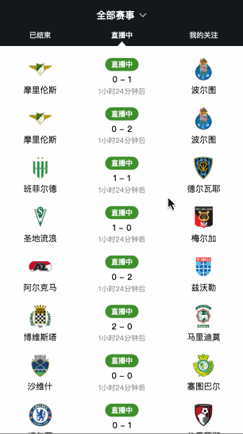

cube-ui 是一个基于 [Vue.js](https://cn.vuejs.org/v2/guide/%20Vue.js) 实现的精致移动端组件库。
它响应迅速、动画流畅，追求极致的交互体验。
总体分为基础、弹层、滚动三大组件模块。可以说基本涵盖了我们移动端所有的组件需求。

那么这里呢，我们想利用它来做一个浏览赛事的 APP 。大体可以分为顶部导航、比赛列表和弹窗三大部分。
首先，用户要可以流畅的滚动列表来查看比赛，并且可以通过下拉列表来刷新赛事情况，以及通过上拉列表的方式来加载更多赛事。其次，用户可以左右滑动 Tab 页，或者点击顶部 Tab 来切换不同状态的比赛。接着，用户还可以对比赛的类型进行选择，你想看篮球、足球还是 Dota ?然后，用户可以对感兴趣的比赛进行订阅，我们利用弹窗来给用户反馈一些提示信息。先给你看一下，最终完成的效果是这样哒~ 。好了，现在就让我们从初始化项目开始吧……



#### 初始化项目
cube-ui 为我们提供了脚手架，可以方便的迅速初始化一个 cube-ui 项目，里面有基本配置和基础代码。然后你就可以开始迅速的使用它了。
```shell
# 在当前目录下初始化一个 cube-ui 项目
$ vue init cube-ui/cube-template
# 在当前目录下创建一个叫application的文件夹，在里面初始化项目
$ vue init cube-ui/template some-sub-application

```
上面两种方法都可以。建议你已经创建了一个空文件夹，然后进入空文件夹后再使用第一种命令，或直接用第二种。
接着，你需要回答一些问题：

```shell
$ vue init cube-ui/cube-template

Generate project in current directory? Yes
  A newer version of vue-cli is available.

  latest:    2.9.3
  installed: 2.8.2

# 为你的项目起个名字
? Project name cube-application-guide
# 起你的项目写一段描述
? Project description A guide for cube application
# 作者
? Author AmyFoxFN <********.com>
# 选择vue种类，第一种是运行时编译，第二种是只运行，建议选后者将编译交给webpack并且体积要小大约30%
? Vue build (Use arrow keys)
❯ Runtime + Compiler: recommended for most users
  Runtime-only: about 6KB lighter min+gzip, but templates (or any Vue-specific HTML) are ONL
Y allowed in .vue files - render functions are required elsewhere
# 是否后编译
? Use post-compile? Yes
# 按需引入组件还是全部引入
? Import type Partly
# 是否自定义主题，使用后编译的情况下可用
? Custom theme? Yes
# rem 布局，使用后编译的情况下可用
? Use rem layout? No
# 是否安装vue-router
? Install vue-router? No
# 是否用ESLint来规范你的代码
? Use ESLint to lint your code? Yes
# 选择一个ESLint预设标准
? Pick an ESLint preset Standard
# 是否建立单元测试
? Set up unit tests No
# 是否建立端对端测试
? Setup e2e tests with Nightwatch? No
```
你可以在[这里](https://github.com/cube-ui/cube-template/wiki) 对以上的问题有更深入的了解
注意，cube-cli 脚手架默认帮我们在 main.js 中注册了很多 cub-ui 的组件，你可以将你不需要的删除。
现在，我们就有了最基本的项目结构，可参考[stage-1](https://github.com/cube-ui/cube-application-guide/tree/stage-1)分支。


　　
现在，你可以通过以下命令，来启动一下项目了。成功后，你会看到一个有 Vue 标志的页面。

```shell
# 安装依赖
$ npm install
# 在本地的8080端口起一个有热刷新功能的服务
$ npm run dev
```
现在，根据功能我们将项目划分出赛事列表组件 MatchList ,以及弹窗组件 SubscribeDialog 。首先，我们在 App.vue 中写一下应用的基本结构。
#### App.vue
我们先构建一下顶部导航部分，此部分可参考[stage-2](https://github.com/cube-ui/cube-application-guide/tree/stage-2) 。

```html
<div id="app">
  <div class="header">
    <div class="title" @click="showPicker">
      <span>全部赛事</span>
      <i class="cubeic-select" :class="{flip: toFlip}" ref="select"></i>
    </div>
    <div class="navigator">
      <ul class="nav-list">
        <li v-for="(item, index) in tabList" :key="index"
          @click="switchTab(index)" :class="{active: currentPage === index}">
          {{ item }}
        </li>
      </ul>
      <div class="triangle-up" :class="{left: currentPage === 0, right: currentPage === 2}"></div>
    </div>
  </div>
  <div class="content">
      <cube-slide>
      </cube-slide>
    </div>
</div>
```

`switchTab` 和 `currentPage` 是为了 Tab 下的小角标随着 Tab 切换而移动的。详细可看[具体代码](https://github.com/cube-ui/cube-application-guide/blob/stage-2/src/App.vue)
但是，用户在手机上只能通过点击顶部的 Tab 来切换不同状态的比赛，是不是太不方便了。而 cube-ui 的 Slide 组件，提供了很流畅的轮播及 Swipe 功能。我们就可以通过它，来丰富我们的移动端体验。

```html
<div class="content">
  <cube-slide
    :data="tabList"
    :initialIndex="currentPage"
    :loop="false"
    :autoPlay="false"
    :threshold="0.1"
    @change="slideChange">
    <cube-slide-item v-for="(item, index) in tabList" :key="index">
      <div class="match-list-wrapper">
        <match-list :type="type" :status="index"></match-list>
      </div>
    </cube-slide-item>
    <div slot="dots"></div>
  </cube-slide>
</div>
```

由于我们的列表内容比较复杂，又是一个组件，所以我们使用了自定义内容。Slide 组件为我们提供了默认插槽和 `cube-slide-item` 来自定义每个轮播页的结构。`cube-slide` 也为我们预留了很多的参数可供设置。比如这里，我们设置了它的初始索引值为1、不循环播放、不自动播放、切换页面的滑动阈值等。详细参考[官方文档](https://didi.github.io/cube-ui/#/zh-CN/docs/introduction)。现在，用户就可以很方便的通过左右滑动来切换 Tab 页了。你可以去[stage-2](https://github.com/cube-ui/cube-application-guide/tree/stage-2) 查看这一步的效果。接下来，我们继续来实现列表部分。
#### MatchList
此部分参考 [stage-3](https://github.com/cube-ui/cube-application-guide/tree/stage-3) 分支。
我们先来实现一下比赛列表的静态样式。

```html
<ul class="match-inner">
  <li v-for="(item, index) in matchList" :key="index" class="match-item">
    <div class="left-team">
      
      <p class="name">{{item.hostTeamName}}</p>
    </div>
    <div class="center">
      <p v-if="item.live" class="guest" :class="{end : item.isEnd}">{{item.live}}</p>
      <p v-if="item.order" class="order" @click="subscribe">{{item.order}}</p>
      <p class="score" :class="{last: item.isEnd}">
        {{item.hostScore}} - {{item.guestScore}}
      </p>
      <p v-if="!item.isEnd" class="time">{{item.endTime}}</p>

    </div>
    <div class="right-team">
      
      <p class="name">{{item.guestTeamName}}</p>
    </div>
  </li>
</ul>
```

MatchList是我们模拟的列表数据，每个 `li` 都是一条赛事，整个 `ul` 是赛事列表。具体的数据渲染以及元素样式，就不一一解释啦，你可以去仓库代码里详细[查看](https://github.com/cube-ui/cube-application-guide/blob/stage-3/src/components/match-list.vue)。接下来，就要为我们的列表组件添加一些丰富的功能了。

##### 滚动
在比赛列表这个组件中，我们的主要功能就是滚动，所以我们可以使用 cube-ui 的 Scroll 组件来完成，从而为用户提供了更流畅的浏览体验，
由上一步可以看到，我们的列表内容还是比较复杂的，所以可以采用默认插槽来自定义内容。也就是说，直接把我们上面的列表内容，包在 `<cube-scroll>` 标签里就行了。当然，如果你的数据十分简单，可以直接将数据传入 `<cube-scroll>` 的 `data`字段  。

```html
<cube-scroll
  ref="scroll"
  :data="matchList" 
  :options="options"
  @pulling-down="onPullingDown"
  @pulling-up="onPullingUp">
  <ul class="match-inner">
    <li v-for="(item, index) in matchList" :key="index" class="match-item">
	  <!-- 内容省略 -->
    </li>
  </ul>
</cube-scroll>
```

虽然我们是自定义内容，但同样建议为 Scroll 的 `data` 属性传入数据，这样 Scroll 组件可以帮我们自动进行数据监听和重新渲染。
`<cube-scroll>` 还为我们提供了很多的参数，你可以通过他们来设置滚动条、滚动方向、开启下拉刷新功能等。详细请参考[官方文档](https://didi.github.io/cube-ui/#/zh-CN/docs/introduction)。
比如这里，我们通过 `options` 的 `scrollbar` 来对滚动条进行设置。你可以选择显示或不显示。这里，我们选择淡入淡出的滚动条。

```js
options: {
  scrollbar: {
     fade: true
},
```

这里还需提醒大家注意一下，在使用 Scroll 组件的时候，为保证正常滚动，内容元素  `.cube-scroll-content`  在滚动方向上的长度必须大于容器元素  `.cube-scroll-wrapper` 。具体滚动原理请去往[官方文档](https://didi.github.io/cube-ui/#/zh-CN/docs/introduction)里查看。
##### 下拉刷新
比赛的变化瞬息万变。用户就需要时不时的刷新列表来获取最新的数据。
Scroll 组件默认无下拉刷新功能，我们需要通过配置项 `pullDownRefresh` 开启。

```js
pullDownRefresh: {
  threshold: 90,
   stop: 50,
   txt: '刷新成功'
}
```

我们为这次下拉动画设置了下拉距离阈值、回弹位置以及刷新成功的文案。
下拉距离阈值你可以理解为，是你下拉到某一个可以开始刷新数据的位置。
回弹位置则是你放手之后列表的恢复位置。这些你都可以去 [文档](https://didi.github.io/cube-ui/#/zh-CN/docs/introduction) 里详细的查看或尝试。

刚才，我们对下拉动作进行了设置。现在，就该写触发了这次动作后你想做的事情，在这里也就是刷新数据了。当用户下拉列表超过阈值时，会触发 Scroll 组件的 `pulling-down` 事件，这个事件我们已经在之前的模板里面绑定了处理函数。而在这个事件的处理函数中，我们可以刷新数据了。

```js
methods: {
onPullingDown () {
  this.loadMatch('down')
},
loadMatch (type) {
      setTimeout(() => {     //这里用setTimeout模拟数据请求,真实情况下你需要向接口请求数据
        if (Math.random() > 0.5) {
          let match = []
          for (let index = 5; index > 0; index--) {
            match.push(this.matchList[index])
          }
          if (type === DOWN) {
            this.matchList.unshift(...match)
          } else if (type === UP) {
            this.matchList = this.matchList.concat(match)
          }
        } else {
          this.$refs.scroll.forceUpdate()
        }
      }, 1000)
    }
}
```

这里需要注意的是，如果请求结果是没有新数据，则必须使用 `this.$refs.scroll.forceUpdate()`  结束此次下拉刷新。这样，Scroll 组件才会开始监听下一次下拉刷新操作。
另外，如果你不喜欢内置的下拉刷新动画，还可以用作用域插槽做自定义动画。详情见[官方文档](https://didi.github.io/cube-ui/#/zh-CN/docs/introduction)。
##### 上拉加载
我们不可能一次放入所有的列表数据，用户可以通过上来加载来查看更多的比赛。
与下拉刷新相同，Scroll 组件默认无上拉加载功能，可通过配置项  `pullUpLoad` 开启。

```js
pullUpLoad: {
  threshold: 100,
  txt: {
    more: '加载更多',
    noMore: '没有更多的比赛啦'
  }
}
```

我们为这次上拉动作设置了上拉距离阈值，以及提示加载和没有更多数据的文案。
那么同样，当用户上拉列表超过阈值时，会触发 Scroll 组件的 `pulling-up` 事件，而在这个事件的处理函数中，我们可以刷新数据了。

```js
methods: {
onPullingUp () {
  this.loadMatch('up')
},
loadMatch (type) {
      setTimeout(() => {     //这里用setTimeout模拟数据请求,真实情况下你需要向接口请求数据
        if (Math.random() > 0.5) {
          let match = []
          for (let index = 5; index > 0; index--) {
            match.push(this.matchList[index])
          }
          if (type === DOWN) {
            this.matchList.unshift(...match)
          } else if (type === UP) {
            this.matchList = this.matchList.concat(match)
          }
        } else {
          this.$refs.scroll.forceUpdate()
        }
      }, 1000)
    }
}
```

与下拉刷新相同，请注意没有数据的情况，以及同样可以用作用域插槽做自定义动画。详情见[官方文档](https://didi.github.io/cube-ui/#/zh-CN/docs/introduction)。
#### 订阅弹窗
我们需要在用户点击订阅后，为用户弹一个开启订阅的弹窗。因为样子比较花，哈哈，所以我们可以基于 cube-ui 的 Popup 封装一个。这也是 cube-ui 为我们提供的一个很好的功能。那这里，就不得不先说一下，cube-ui 的另一个是非重要的 API了。
##### createAPI方法
`createAPI` 的作用是把我们之前声明式的组件使用方式改变成 API 式的调用。我们知道 Vue 推荐的就是声明式的组件使用方式，比如在使用一个组件 xxx，我们简单在使用的地方声明它就好了。

```html
<tempalte>
  <xxx/>
</tempalte>
```

对于一般组件，这样使用并没有问题，但对于全屏类的弹窗组件，如果在一个层级嵌套很深的子组件中使用，仍然通过声明式的方式，很可能它的样式会受到父元素某些 CSS 的影响导致渲染不符合预期。这类组件最好的使用方式就是挂载到 body 下，但是我们如果是声明式地把这些组件挂载到最外层，对它们的控制也非常不灵活。其实最理想的方式是动态把这类组件挂载到 body 下，createAPI 就是干这个事情的。
我们现在就用它来做我们的订阅弹窗。


cube-ui 提供了所有弹窗类组件的基类组件 Popup，如果是新增一个弹窗类组件，推荐基于 Popup 做二次开发。我们这里就是基于 Proup 封装了名为 subscribe-dialog 的弹窗组件。
首先我们在 main.js 中通过 createAPI 创建一个 `this.$createSubscribeDialog` API，把 SubscribeDialog 变成一个 API 式调用的组件：

```js
import SubscribeDialog from './components/subscribe-dialog/subscribe-dialog'
createAPI(Vue, SubscribeDialog, [], true)
```

接着我们就可以在 MatchList 组件内部通过 this.$createSubscribeDialog() 的方式调用它

```js
this.subscribeDialog = this.$createSubscribeDialog()
```

当你想让这个弹窗显示，就执行 `.show()` 方法。当执行 .show 的时候，cube-ui 内部会把 SubscribeDialog 组件动态挂载到 body 下。

你还可以为你的弹出层做 mask 之类更详细的配置,这一部分你可以参考项目中的 [stage-4](https://github.com/cube-ui/cube-application-guide/tree/stage-4) 分支。
cube-ui 的弹出层组件部分，还包含了 Picker、TimePicker、Dialog 等其他弹出层，详情见[官方文档](https://didi.github.io/cube-ui/#/zh-CN/docs/introduction)。

#### 赛事选择
我们希望用户在点击顶部的全部赛事后，由屏幕下方上滑出一个弹窗，供用户选择比赛类型。像这样：


这时，就可以使用 cube-ui 的 Picker 组件。用户可以通过屏幕下边上滑出的 Picker，来选择想看的比赛类型。点击确认后，如果确认值有变，则更新比赛列表。并且点击取消、确定以及 Picker 之外的地方时，都让 Picker 消失。同样，Picker 也是用 CreateAPI 创建的。此部分见 [stage-5](https://github.com/cube-ui/cube-application-guide/blob/stage-5/src/App.vue) 分支。

```js
mounted () {
  this.picker = this.$createPicker({
     title: '赛事',
     data: [this.pickerList],
     onSelect: () => {   //点击确定时
       this.toFlip = !this.toFlip
     },
     onCancel: () => {  //点击取消时
       this.toFlip = !this.toFlip
     },
     onValueChange: (selectedVal) => {   //确认的值有改变时
       this.type = selectedVal[0]
     }
   })
}
```

我们创建了 Picker，并为它的 `data` 字段传入表示比赛类型的数组。然后你可以在它的各种事件处理函数中做你想做的事情。还可以为这个 Picker 做一些其他更详细的配置，详情见[官方文档](https://didi.github.io/cube-ui/#/zh-CN/docs/introduction)

### 总结
到这里，我们的应用可以说是基本完成了。但其实，也还只是用了 cube-ui 几个比较主要的组件。cube-ui 还有很多很棒的组件，如表单、开关、loading 等，如果你有兴趣的话，也可以继续丰富我们这个赛事应用。当然，你也已经完全可以借助 cube-ui ，开始一个自己的项目啦~
